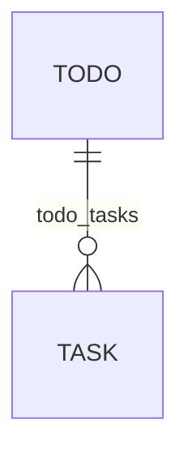

# todothis

A basic todo API service

## Requirements

- MySQL
- Go

## Run

On base directory, run: `go run cmd/main.go`

## API

- `[GET] /todos` - Fetches all TODO created

    Output:
    ```
    {
        "todos" :[
            {
                "id": 123,
                "title": "First TODO!"
                "tasks": [
                    {
                        "id" : 1,
                        "content": "Something"
                    }
                ]
            },
            {
                "id": 123,
                "title": "First TODO!"
            },
        ]
    }
    ```

- `[GET] /todos/:id` - Fetches a specific TODO item

    Output:
    ```
    {
        "id": 123,
        "title": "First TODO!"
        "tasks": [
            {
                "id" : 1,
                "content": "Something"
            }
        ]
    }
    ```

- `[POST] /todos/new` - Creates a new TODO item

    Output:
    ```
    {
        "id": 123,
        "title": "First TODO!"
        "tasks": [
            {
                "id" : 1,
                "content": "Something"
            }
        ]
    }
    ```

- `[POST] /todos/:id/add-task` - Creates a new TASK under a TODO item

    Output:
    ```
    {
        "id": 123,
        "title": "First TODO!"
        "tasks": [
            {
                "id" : 1,
                "content": "Something"
            },
            {
                "id" : 2,
                "content": "New Task!"
            }
        ]
    }
    ```

- `[POST] /todos/:id/edit-task/:task_id` - Edits a TASK under a TODO item

    Output:
    ```
    {
        "id": 123,
        "title": "First TODO!"
        "tasks": [
            {
                "id" : 1,
                "content": "Something"
            },
            {
                "id" : 2,
                "content": "Edited Task!"
            }
        ]
    }
    ```

- `[POST] /todos/:id/delete-task/:task_id` - Deletes a TASK under a TODO item

    Output:
    ```
    {
        "id": 123,
        "title": "First TODO!"
        "tasks": [
            {
                "id" : 1,
                "content": "Something"
            }
        ]
    }
    ```

- `[POST] /todos/:id/reorder-task/:task_id` - Reorders a TASK under a TODO item
    
    Parameters:
    ```
    {
        "sort_id": 1
    }
    ```

    Output:
    ```
    {
        "id": 123,
        "title": "First TODO!"
        "tasks": [
            {
                "id" : 1,
                "content": "Something"
            }
        ]
    }
    ```


## Structure

- Architecture: Based on CLEAN Architecture



### todos
| field       | type   |
|-------------|--------|
| id          | uint   |
| title       | string |
| description | string |

### tasks
| field       | type   |
|-------------|--------|
| id          | uint   |
| content     | string |
| done        | boolean|

### todo_tasks
| field       | type   |
|-------------|--------|
| id          | uint   |
| todo_id     | int64  |
| task_id     | int64  |
| sort_id     | int64  |
